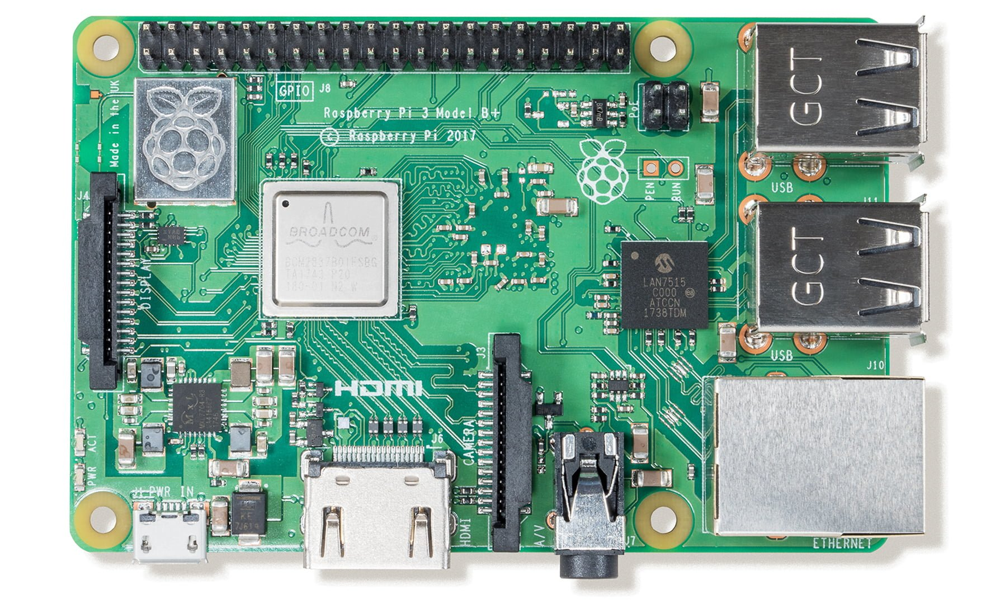

_Raspberry Pi 3+_
            
A few days ago I managed to remove files from my Pi that stopped it working. I was thinking about rebuilding it anyway so figured now is the time to do it. Details for installing the Pi are below

#### Step 1: Download the latest version of Raspbain Lite

This can be downloaded from the following URL <https://www.raspberrypi.org/downloads/raspbian/>

#### Step 2: Unzip download

The download is a compressed file so you need to unzip it. There are plenty of tools out there that enable you to do this.

#### Step 3: Write the image to SD Card

I used a [SanDisk Ultra 128GB microSDXC](https://www.amazon.co.uk/gp/product/B073JYC4XM) from Amazon, at the time of writing it is only £24.   
A good application for writing the image to SD Card is [Etcher](https://www.balena.io/etcher/). You can find the instructions for using it on their website.

#### Finally

Put the card into your RaspberryPi and boot it up. I will detail what I did next in another post. I’ve posted about headless mode here.