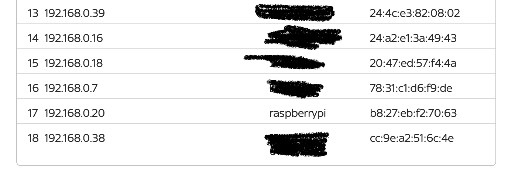
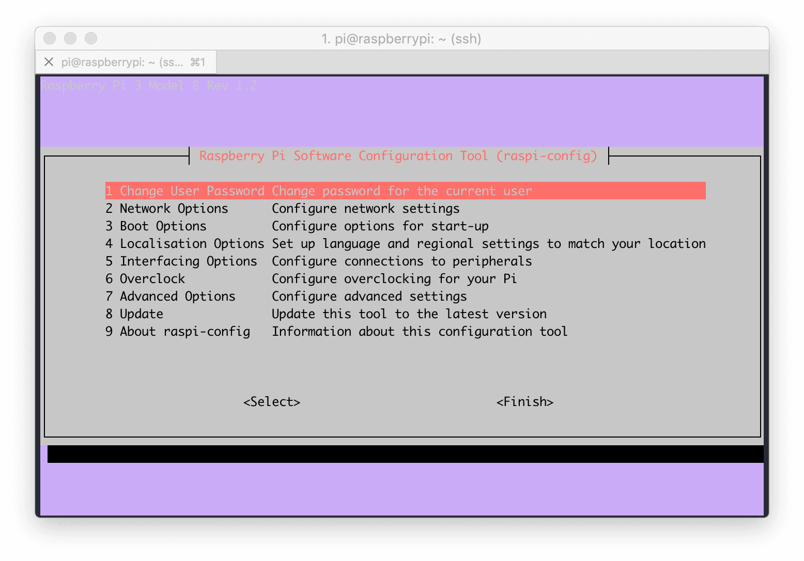
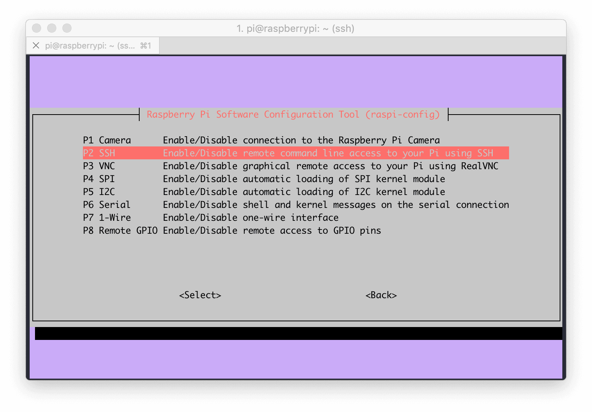
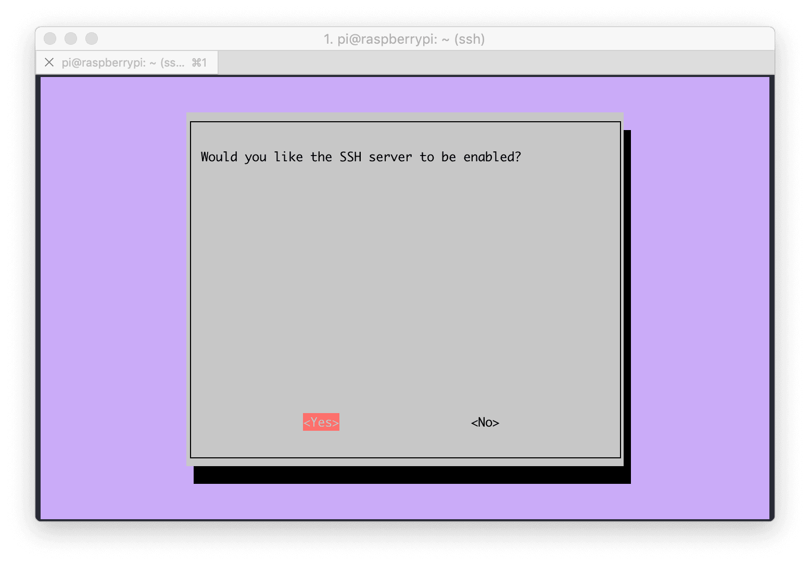

Normally when I’m running my Pi I don’t have it connected to a monitor or keyboard. This means that when installing it, I need to install it in headless mode. Below are details on how I setup in headless mode. Before doing this, you need to setup the SD Card as detailed in [Building Raspberry Pi](http://www.kenlea.me.uk/2018/12/building-raspberry-pi/).

#### Step 1: Enable SSH

[SSH](https://en.wikipedia.org/wiki/Secure_Shell) is what I use to connect to my Pi. How I connect to my Pi and is disabled by default. However, it is possible to enable it from initial boot by creating a file called **ssh** on the root of the SD Card. This will enable ssh for one time only, I will explain later how to permanently enable it. *NOTE: If you are using Windows make sure that the file is created with no extension. On Mac or Linux you can simply type ‘touch ssh’ and copy that file onto the SD Card*

#### Step 2: Add Wifi Network

If you are going to be using WiFi to connect to your network, you need to add the WiFi connection. First create a file called **wpa\_supplicant.conf** then add the following into the file

```
country=US
ctrl_interface=DIR=/var/run/wpa_supplicant GROUP=netdev
update_config=1
network={
    ssid="NETWORK-NAME"
    psk="NETWORK-PASSWORD"
   }
```

You will need to update the text that is in bold the the appropriate values for your network. Once you have this file, copy it to the root of the SD Card. (The same location as the ssh file).

#### Step 3: Boot the Pi

You now need to put the SD Card back into the Pi and boot it up. Once booted we need to find out it’s ip address. I just login to my Router and get it from there.




#### Step 4: SSH to the Pi

Once the Pi is booted you beed to ssh to it. There are a number of ssh clients that you can use. On Linux or the Mac, one is already installed. On Windows you can either install [Putty](https://www.putty.org/), or you could install the full version of [Cmder](http://cmder.net). I will be assuming you are using the command line either on Linux / Mac or using Cmder.

By default the main user on a Raspberry Pi is *pi* with the password of *raspberry*. You can connect to your Pi using the following command

```bash
ssh pi@xxx.xxx.xxx.xxx
```

Where *xxx.xxx.xxx.xxx* is the ip address of your Raspberry Pi.

#### Step 5: Permanently Enable SSH

Currently SSH on the Pi is only temporary enabled. To permanently enable it do the run the following command

```bash
sudo raspi-config
```

This will start the Software Configuration Tool
            

_Select option *5 Interfacing Options*_


_From this menu select *P2 SSH*_


_Select Yes_
            
Once you have selected Yes, SSH will be permanently enabled. Click on OK and then select Finish. Next step is to secure your Pi. I will cover this in another post