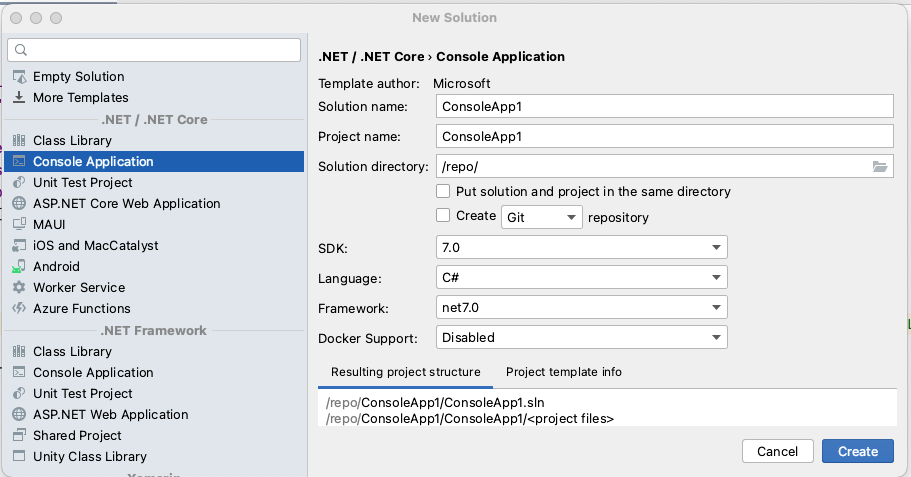

---

title: '.Net 7 Console App with Serilog: Step-by-Step Instructions'
date: 2023-05-25 9:00:00 +00:00
layout: post
permalink: /2023/05/net-7-console-app-with-serilog/
slug: /2023/05/net-7-console-app-with-serilog/
categories:
    - Dotnet 
tags:
    - Dotnet
    - Serilog
    - Logging

---

> This article explains how to create a console application with logging in place using .Net SDK, Visual Studio, and Serilog. It covers setting up the project, configuring dependency injection, creating the base application, and adding Serilog. It also explains the purpose of each NuGet package used and how to configure Serilog using the Configuration Manager and Dependency Injector.

I’m a big fan of doing Proof of Concepts using a console application. The reason for this is that often what is being looked into has zero UI requirements so why use one? I also like to make sure that I have logging in place to help me understand what is going on. Below I will show how to achieve this simply.

## Prerequisites

To follow along, you need to make sure that you have the following installed

* .Net SDK This can be version 6 or 7
    
* Visual Studio or another IDE (VS Code or JetBrains Rider are other options)
    

## Creating the project

We can easily create the project from the command line.

```bash
dotnet new sln —output Sample.Console
```

This will create a new folder called `Sample.Console` containing out solution file, called `Sample.Console.sln`

Next, run the following code to create the project

```bash
dotnet new console —output Sample.Console/Sample.Console
```

This will create the `Sample.Console` project within a folder called `Sample.Console/Sample.Console`.

Finally, we need to add the project to the solution, to do this we run the following command.

```bash
dotnet sln Sample.Console add Sample.Console/Sample.Console
```

Another way to create the solution is by using the app of your choice. Sometimes, it’s good to know how to do things in the command line 😀


_Project Selection uisng JetBrains Rider_

## Configure Dependency Injection

I’m a firm believer in Dependency Injection, so before adding Serilog we will set the project to use DI. We will use the inbuild Dotnet `ServiceCollection` object to do this, there are lots of 3rd party DI Containers but these days 90% of the time this is sufficient.

Run the following commands to add the required packages, that we will need to create the console application.

```bash
dotnet add package Microsoft.Extensions.DependencyInjection —version 7.0.0
dotnet add package Microsoft.Extensions.Hosting —version 7.0.1
dotnet add package Microsoft.Extensions.Logging —version 7.0.0
dotnet add package Microsoft.Extensions.Configuration —version 7.0.0
```

These packages will enable us to configure Dependency Injection, read settings from an `appsettings.json` file and use a Worker Service to manage the Dependency Injection. (More info about the Worker Service Generic Host can be found [here](https://learn.microsoft.com/en-us/dotnet/core/extensions/generic-host))

### Create base application

Once we have the initial dependencies added we will create the initial base application. To do this we add the following code to the Program.cs file

```csharp
using Microsoft.Extensions.Configuration;
using Microsoft.Extensions.DependencyInjection;
using Microsoft.Extensions.Hosting;
using Microsoft.Extensions.Logging;
using Serilog;


using IHost host = Host.CreateDefaultBuilder(args)
    .ConfigureHostConfiguration(configHost =>
    {
        configHost.SetBasePath(Directory.GetCurrentDirectory());
        configHost.AddJsonFile(“appsettings.json”, optional: true);
    })
    .ConfigureServices(services =>
    {
    })
    .Build();
```

The `ConfigureHostConfiguration` section configures the configuration manager to read from our `appsettings.json` file. We could do more with the configuration, such as getting them from environment variables, but that is another story.

The `ConfigureServices` section is where we add our services, for this example, we will not be adding any.

## Add Serilog

The next thing that we need to do is to add Serilog to the project. Once again we will use the command line as each IDE can be different to how it’s added. So we need to navigate to the project folder within the terminal. From the project folder, we will add the following NuGet packages.

```bash
dotnet add package Serilog —version 2.12.0
dotnet add package Serilog.Settings.Configuration —version 7.0.0
dotnet add package Serilog.Extensions.Hosting —version 7.0.0
dotnet add package Serilog.Sinks.Console —version 4.1.0
```

So what is each of these packages used for?

* `Serilog`is the main logging package.
    
* `Serilog.Setting.Configuration` enables us to configure the logging via the Configuration Manager that we set up earlier. Basically, it will get the setting from where the Configuration Manager gets its information, for us this will be the *appsettings.json* file.
    
* `Serilog.Extensions.Hosting` enables us to set up Serilog in the Dependency Injector easier.
    
* `Serilog.Sinks.Console` is used to write the logging that we do to the console output. It’s possible to have more than one sink and have each log different information.
    

To setup the Serilog logging, we need to add the following to the end of the `CreateDefaultBuilder` after the `ConfigureServices` section.

```csharp
.UseSerilog((context, configuration) =>
{
    configuration.ReadFrom.Configuration(context.Configuration);
})
```

This tells Serilog to read its configuration from the Configuration Manager and also configures our dependency injection. The settings that we need to add to the `appsettings.json` file are below

```json
“Serilog”: {
    “Using”: [ “Serilog.Sinks.Console” ],
    “MinimumLevel”: “Verbose”,
    “WriteTo”: [
      {
        “Name”: “Console”,
        “Args”: {
          “restrictedToMinimumLevel”: “Debug”,
          “theme”: “Serilog.Sinks.SystemConsole.Themes.AnsiConsoleTheme::Code, Serilog.Sinks.Console”,
          “outputTemplate”: “{Timestamp:yyyy-MM-dd HH:mm:ss.fff zzz} [{Level:u3}] {Message:j}{NewLine}{Properties:j}{NewLine}{Exception}”
        }
      }
    ]
  }
```

That’s it, if we now add the following lines to the end of our `Program.cs` file, and run the application we will see the log output to the console.

```csharp
// logging
var logger = host.Services.GetService<ILogger<Program>>();

logger.LogDebug(“Test serilog”);
```

Whenever we inject an `ILogger` into code, the logger will then use the configured Serilog to log our messages.

### Not logging?

Generally, I have found that 9 times out of 10 when I do this, and logging does not occur, the issue is due to the Serilog configuration settings.

## Links for further reading

[https://serilog.net](https://serilog.net)

[https://github.com/serilog/serilog-extensions-hosting](https://github.com/serilog/serilog-extensions-hosting)

[https://github.com/serilog/serilog-settings-configuration](https://github.com/serilog/serilog-settings-configuration)